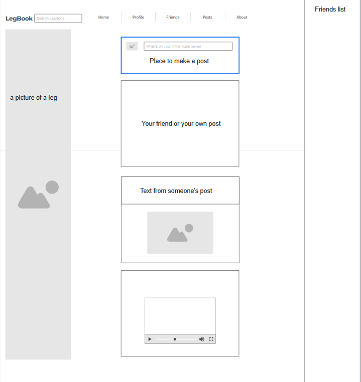

# LegBook: A Facebook Clone

## Project Spec

LegBook is a full-stack social networking website inspired by Facebook, but with a unique twist—focusing entirely on leg-themed content and interactions. The platform allows users to create profiles, share posts, interact with friends, and explore content centered around the theme of legs. It is designed to offer a fun, engaging experience while fulfilling the specified requirements of the project description.

### Features and Functionality

Note: I may or may not implement all these features. This is a list of ideas that would be nice to implement.

- Main Page: A welcoming page where users can log in, sign up, or explore the platform. This page includes a brief introduction to LegBook and the concept behind it. It will also showcase featured leg-related content to entice users to join and engage with the community.
- User Profiles: Users can create and customize their profiles, uploading leg-related images and providing basic information such as a username, bio, and location. Users will have the option to add a "Leg Interests" section where they can list specific areas of leg-related content they enjoy (e.g., fitness, fashion, art).
- Posts: Users can share content such as text, images, and videos related to legs. Examples could include fitness routines, fashion tips, or even humorous leg photos. Posts can be liked, commented on, and shared with friends or publicly. Posts can also be tagged with specific leg-related hashtags to categorize the content.
- Friend System: Users can send, receive, and accept friend requests. Once friends, they can view each other’s posts, comment on them, and share content with each other. Friendships will be the backbone of user engagement and content sharing on LegBook.
- Private Messaging: Users can communicate directly with each other in a secure, private messaging system. Messaging will allow for one-on-one communication, with the option to send multimedia (images/videos) related to legs.
- Search Functionality: Users can search for other users by name or find leg-related posts and content using keywords, hashtags, or tags. This search will help users discover new content, connect with like-minded individuals, and explore the leg-themed world of LegBook.
- AWS Backend: LegBook’s back-end will be powered by AWS, storing user data, posts, and messages securely. AWS will also handle server-side logic, user authentication, and data management.

### Data Management

The data managed in the web application will include the following:
- User Profiles: Basic user data such as usernames, profile pictures, bios, and "Leg Interests". Data will be dynamically linked to user posts, allowing for easy tracking of content created by individual users.
- Posts: Each post will contain text, images, videos, likes, and comments. Posts will be linked to specific users and will be part of the newsfeed and other interaction features.
- Friendships: Data about users' relationships with each other, including sent, received, and accepted friend requests. Friend connections will allow users to view each other’s posts and send private messages.
- Messages: Private messages sent between users, including multimedia content like images or videos. Messages will be encrypted to ensure privacy.

### Target Audience

LegBook is designed for anyone who likes Facebook but it's better, because it's LegBook. Here are some target groups for this web application:
- Leg Enthusiasts: People who have a special interest in legs, whether it be related to fitness, fashion, or humor. They will enjoy creating and sharing leg-centric content on a fun platform.
- Fitness Enthusiasts: Individuals who are passionate about leg workouts, leg day routines, or sports that involve legs (running, cycling, etc.) can connect with others who share the same fitness interests.
- General Users: People looking for a lighthearted, quirky, and creative social networking experience. This platform offers a unique take on social media with fun, leg-themed interactions.

### Stretch Goals

Once the project is fully implemented and is fully functional, the following extra features will be added:
- Public Pages: Users can create pages focused on leg-related topics, events, or products.
- Advanced Search: A more complex search system that allows filtering by post type, hashtags, or specific user interests.
- User Analytics: Provide users with the ability to track the performance of their posts (e.g., views, likes, comments) through a personalized analytics dashboard, helping them optimize content and engagement strategies.

## Project Wireframe

